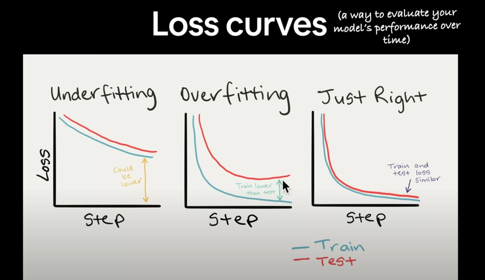
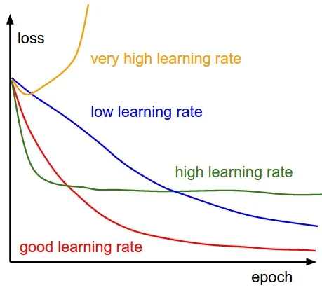
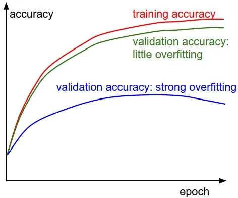

# Image Classification

Determining the number of layers and nodes in a neural network is a process that involves both experimentation and understanding of the problem being solved. Here are some general guidelines:

1. __Problem complexity__: The number of layers and nodes can vary depending on the complexity of the problem being solved. For simple problems, a shallow network with fewer layers and nodes may suffice, while more complex problems may require deeper networks with more nodes.

2. __Data size__: The size of the training data also plays a role in determining the number of layers and nodes. Larger datasets may require deeper networks with more nodes to capture the relationships within the data.

3. __Overfitting__: One must be careful not to add too many layers or nodes, as this can result in overfitting the training data. Overfitting occurs when the model becomes too complex and starts to memorize the training data, leading to poor generalization to new data.

4. __Experimentation__: The best way to determine the number of layers and nodes is through experimentation. Start with a basic network structure and gradually increase the complexity by adding more layers and nodes. Evaluate the performance of each iteration on a validation set and select the structure that gives the best performance.

These are general guidelines, and the optimal number of layers and nodes can vary depending on the specific problem and dataset.


## Example

The number of layers and nodes for a neural network to classify cats and dogs depends on several factors, such as the complexity of the task, the size of the dataset, and the computational resources available.

For a simple problem like this, a small network with just one or two hidden layers, each with a few hundred nodes, could be sufficient. Here's an example of a neural network architecture:

- Input layer: Inputs the image data, with the number of nodes equal to the number of pixels in the image. (128, 128, 3)

- Hidden layer 1: A fully connected layer with, for example, 256 nodes, that uses an activation function to introduce non-linearity into the network.

- Output layer: A fully connected layer with two nodes, one for each class (cat and dog), that uses a softmax activation function to produce a probability distribution over the two classes.

It's important to note that this is just an example, and the actual optimal number of layers and nodes may be different based on the specifics of your problem and data. The best way to determine the optimal architecture is to experiment with different network configurations and evaluate their performance on a validation set.  

Here's an example code in TensorFlow for a neural network to classify cats and dogs:  

```py
import tensorflow as tf

model = tf.keras.Sequential()
model.add(tf.keras.layers.Flatten(input_shape=(128, 128, 3)))
model.add(tf.keras.layers.Dense(256, activation='relu'))
model.add(tf.keras.layers.Dense(2, activation='softmax'))

model.compile(optimizer='adam',
              loss='categorical_crossentropy',
              metrics=['accuracy'])
```

Here's an example code in PyTorch for a neural network to classify cats and dogs:  

```py
import torch
import torch.nn as nn
import torch.nn.functional as F

class Classifier(nn.Module):
    def __init__(self):
        super(Classifier, self).__init__()
        self.fc1 = nn.Linear(128 * 128 * 3, 256)
        self.fc2 = nn.Linear(256, 2)
        
    def forward(self, x):
        x = x.view(-1, 128 * 128 * 3)
        x = F.relu(self.fc1(x))
        x = self.fc2(x)
        return x

model = Classifier()
criterion = nn.CrossEntropyLoss()
optimizer = torch.optim.Adam(model.parameters(), lr=0.001)
```

- The first layer is a Flatten layer which takes an input shape of (128, 128, 3), meaning an image with height and width of 128 pixels and 3 color channels (RGB). The flatten layer flattens the input image into a 1D vector, so that it can be fed into the dense layer.  

- The second layer is a dense layer with 256 neurons and a ReLU activation function. This layer performs the linear combination of the inputs and then applies the activation function to produce its output.  

- The third layer is a dense layer with 2 neurons and a softmax activation function. The softmax activation function is commonly used in the final layer of a classification model, as it returns a probability distribution over the classes.  

The image data is first passed through the Flatten layer in TensorFlow or the view operation in PyTorch, which reshapes the input tensor into a one-dimensional array. The flattened data is then passed through the dense (fully connected) layers of the network, which perform the classification task.  

A fully connected layer where each neuron in the layer is connected to every neuron in the previous layer. The input to a fully connected layer is a 1D vector, and the output is another 1D vector, which is then passed to the next layer. The weights between the neurons in the layer are learned during training. They are typically followed by activation functions, such as ReLU or sigmoid, that introduce non-linearity into the model.  

Here is an example of a convolutional neural network (ConvNet) code in TensorFlow using the same dataset:  

```py
import tensorflow as tf

model = tf.keras.Sequential()
model.add(tf.keras.layers.Conv2D(32, (3, 3), activation='relu', input_shape=(128, 128, 3)))
model.add(tf.keras.layers.MaxPooling2D(pool_size=(2, 2)))
model.add(tf.keras.layers.Conv2D(64, (3, 3), activation='relu'))
model.add(tf.keras.layers.MaxPooling2D(pool_size=(2, 2)))
model.add(tf.keras.layers.Flatten())
model.add(tf.keras.layers.Dense(256, activation='relu'))
model.add(tf.keras.layers.Dense(2, activation='softmax'))

model.compile(optimizer='adam',
              loss='categorical_crossentropy',
              metrics=['accuracy'])
```

In this code, we use two Conv2D layers, each followed by a MaxPooling2D layer. These layers extract features from the input images and reduce the spatial dimension, making the model more computationally efficient.  

After the Conv2D and MaxPooling2D layers, we use a Flatten layer to convert the output of the ConvNet into a 1D vector, which can then be fed into the dense layers for classification. The dense layers are similar to the ones in the previous code, but in this case, they take the output of the ConvNet as input.  

To summarize, an epoch is a complete iteration over the entire training dataset, while a batch is a subset of the training data used during each iteration of the optimization process.  


## Models

1. Classify `Happy` and `Sad` people in the image.  
    - Input: Image size = 256 x 256  
    - Output: Probability of being happy is 0 and sad is 1


2. Classify `Aedes` and `Culex` mosquito in the image.  
    - Input: Image size = 128 x 128  
    - Output: Probability of being {Aedes, Culex}


3. Classify `mnist` number in the image.
    - Input: Image size = 227 x 227
    - Output: Probability of being each digits


4. Classify `Copper`, `Brass`, `Euro1`, `Euro2` coin in the image.
    - Input: Image of all the coins
    - Output: Image of label coins


5. Classify `Flowers` in oxford dataset.
    - Input: Image of the unknown flower
    - Output: Probabilities of the classes


6. Classify `Traffy Fondue` dataset.
    - Input: Image of the traffy fondue
    - Output: Probabilities of the classes


## Diagnose Neural Network

### Loss Curve

One of the most used plots to debug a neural network is a Loss curve during training. It gives us a snapshot of the training process and the direction in which the network learns.




### Accuracy Curve

Another most used curves to understand the progress of Neural Networks is an Accuracy curve. A more important curve is the one with both training and validation accuracy. The gap between training and validation accuracy is a clear indication of overfitting. The larger the gap, the __higher__ the __overfitting__.




## Resource

- [happy classification github](https://github.com/nicknochnack/ImageClassification)
- [happy classification tutorial](https://youtu.be/jztwpsIzEGc)
- [AI Learns the Numbers](https://www.youtube.com/watch?v=2utAfvGAbgg)