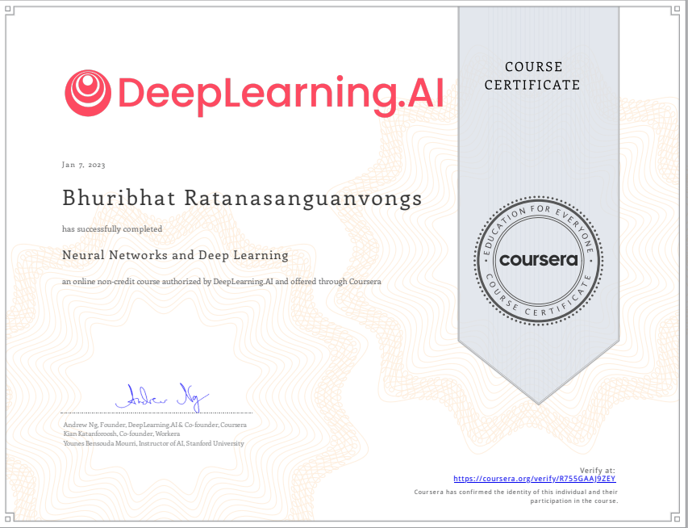

# 📑 References

<!-- TODO add link -->
## Week 1 - Introduction to Deep Learning
*Analyze the major trends driving the rise of deep learning, and give examples of where and how it is applied today.*

## Week 2 - Neural Networks Basics 
*Set up a machine learning problem with a neural network mindset and use vectorization to speed up your models.*

- [Python Basics With Numpy](https://github.com/Bhuribhat/Neural-Networks-and-Deep-Learning/blob/main/1_Python_Basics_with_Numpy.ipynb)

- [Logistic Regression with a Neural Network mindset](https://github.com/Bhuribhat/Neural-Networks-and-Deep-Learning/blob/main/2_Logistic_Regression_with_Neural_Network.ipynb)

- [Implementing a Neural Network from Scratch in Python – An Introduction](https://github.com/dennybritz/nn-from-scratch) (Denny Britz, 2015)

- [Why normalize images by subtracting dataset's image mean, instead of the current image mean in deep learning?](https://stats.stackexchange.com/questions/211436/why-normalize-images-by-subtracting-datasets-image-mean-instead-of-the-current) (Stack Exchange)

## Week 3 - Shallow Neural Networks 
*Build a neural network with one hidden layer, using forward propagation and backpropagation.* 

- [Planar data classification with one hidden layer]()

- [Convolutional Neural Networks for Visual Recognition](https://cs231n.github.io/neural-networks-case-study/) (Stanford University)

## Week 4 - Deep Neural Networks
*Analyze the key computations underlying deep learning, then use them to build and train deep neural networks for computer vision tasks.*

- [Building your Deep Neural Network Step by Step]()

- [Deep Neural Network Application]()

- [Autoreload of modules in IPython](https://stackoverflow.com/questions/1907993/autoreload-of-modules-in-ipython) (Stack Overflow)

<!-- TODO add href -->
# 🏆 Certificates 
To verify the certificates, click the images to follow the links.

    